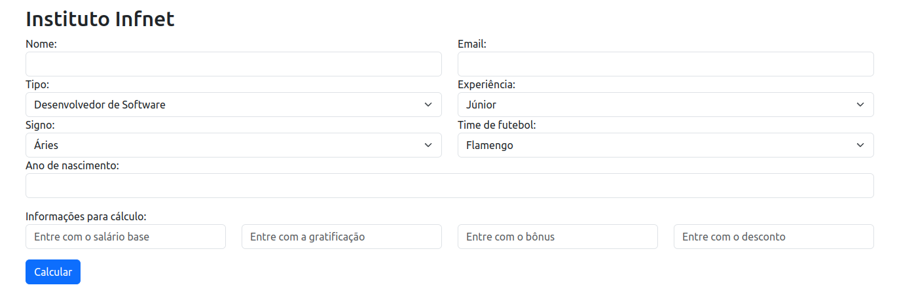
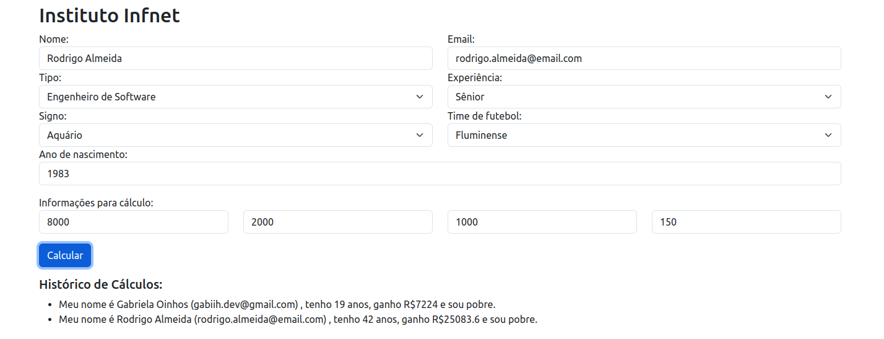

# Projeto de Gestão Salarial

Este projeto é uma aplicação web para o gerenciamento de informações de funcionários e cálculo de salários. Ele permite que você insira dados de funcionários, calcule o salário líquido baseado em diferentes variáveis, e armazene um histórico de cálculos realizados.

## Linguagens e Tecnologias Utilizadas
- HTML: Estrutura da página web.
- CSS (via Bootstrap): Estilo e responsividade da aplicação.
- JavaScript: Lógica de cálculo de salários e manipulação do DOM.

## Funcionalidades

1 . Cadastro de informações pessoais dos funcionários, como nome, e-mail, ano de nascimento, signo, time de futebol, tipo de cargo e experiência.

2 . Cálculo do salário líquido, levando em consideração: salário base, gratificação, bônus, desconto e adicionais baseados no tipo de cargo (experiência, signo e time de futebol).

3 . Armazenamento de um histórico de cálculos realizados, para visualização posterior.

4 . Cálculo de adicionais salariais baseado na idade do funcionário.


## Como utilizar?

1 . Clone este repositório em sua máquina local:

```
git clone https://github.com/gabiihdev/Projeto_Gestao_Salarial.git
```

2 . Abra o arquivo index.html em seu navegador para começar a usar a aplicação.

3 . Preencha os campos com as informações solicitadas e clique no botão **Calcular** para ver o salário líquido calculado e o status financeiro do funcionário.



4 . O Histórico de Cálculos será exibido abaixo, com os resultados de todos os cálculos realizados.

